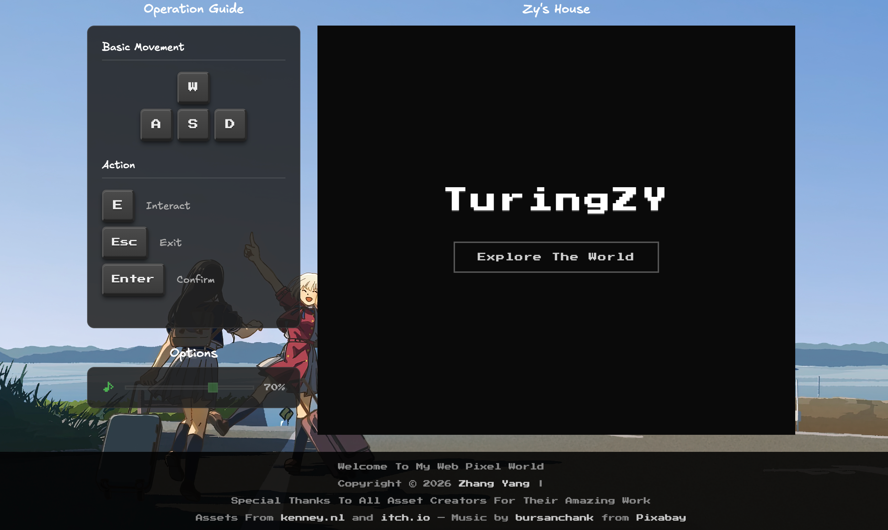
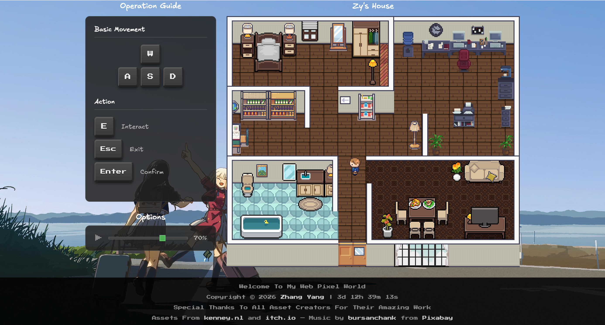
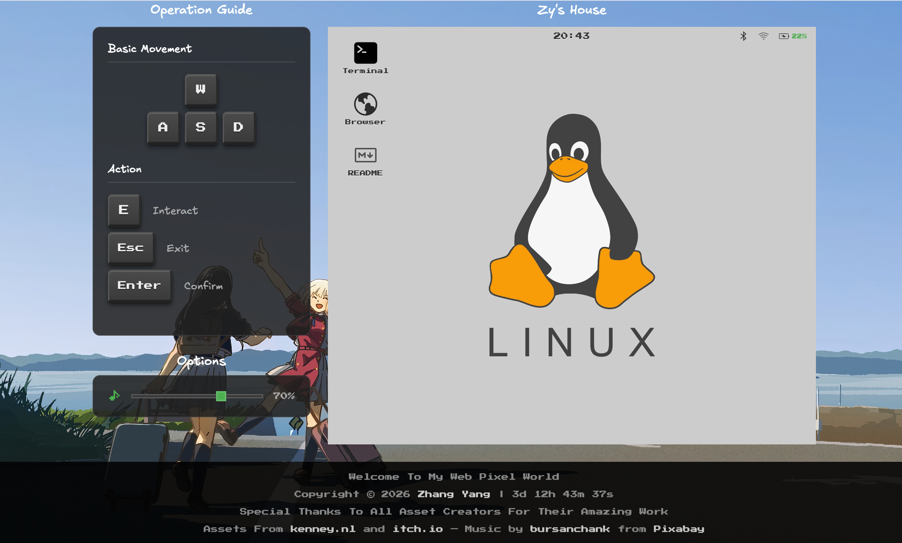
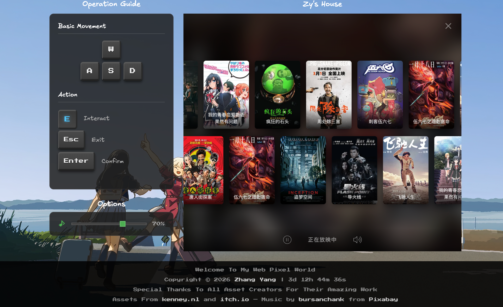

# Zy's House

这是个灵感来自 [async-area](https://async-area.com/) 的 2.5D 像素风格室内探索游戏（其实是个人导航网站😊），完全使用 Phaser 3 和原生 JavaScript 构建，地图由 [Tiled](https://www.mapeditor.org/) 制作；整个项目主打纯粹极简，不依赖任何构建工具、包管理器或打包器，所有文件均作为静态资源直接提供。

## 效果





....

## 快速开始

```bash
# 启动本地服务器
# 方式 A
python -m http.server 8080
# 方式 B
npx http-server -p 8080

# 浏览器打开
http://localhost:8080/
```

## 项目结构

```
zy-house/
├── index.html              # 入口文件
├── assets/                 # 图片、音频、地图数据
│   ├── map.json            # Tiled 地图
│   ├── player.png          # 角色精灵图
│   └── ...
├── conf/                   # 配置数据
│   ├── interactables.json  # 交互对象配置
│   ├── books.json          # 书架数据
│   ├── posters.json        # 电视海报数据
│   ├── linux-commands.json # 终端命令
│   ├── window.json         # 窗户打开后的随机图片API
│   ├── websites.json       # 浏览器书签
│   └── readme.md           # Computer 内 README 内容
├── css/                    # 样式文件
├── js/
│   ├── main.js             # Phaser 配置
│   ├── scenes/             # 游戏场景
│   │   ├── BootScene.js
│   │   ├── StartScene.js
│   │   ├── LoadingScene.js
│   │   └── GameScene.js
│   ├── systems/            # 游戏系统
│   │   └── InteractionManager.js
│   └── apps/               # 交互应用
│       ├── ComputerApp.js  # 桌面电脑（终端、浏览器、README）
│       ├── MirrorApp.js     # 镜子
│       ├── TelevisionApp.js # 电视
│       ├── BookshelfApp.js  # 书架
│       └── WindowApp.js     # 窗户
└── CLAUDE.md
```

## License

本项目仅供个人学习和展示使用。素材来自 [kenney.nl](https://kenney.nl/) 和 [itch.io](https://itch.io/)。